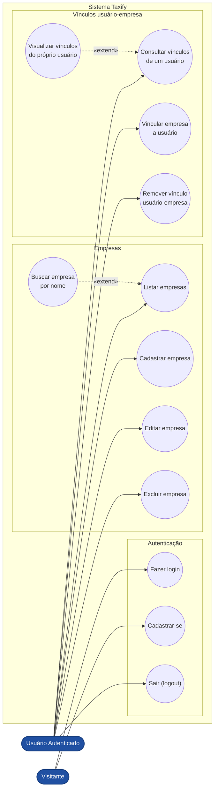

# Diagrama de Casos de Uso — Taxify

Cobre todas as telas e funcionalidades disponíveis no front-end: autenticação
(login/cadastro), CRUD de empresas e gestão do vínculo usuário↔empresa.

## Descrição dos casos de uso

### Autenticação
| Caso de uso | Ator | Descrição |
|---|---|---|
| Fazer login | Visitante | Autentica com login e senha (tela dividida com painel ilustrado, carrossel para o cadastro). |
| Cadastrar-se | Visitante | Wizard de 3 etapas (Dados pessoais, Contato, Senha) para criar um novo usuário. |
| Sair (logout) | Usuário Autenticado | Encerra a sessão e retorna à tela de login. |

### Empresas
| Caso de uso | Ator | Descrição |
|---|---|---|
| Listar empresas | Usuário Autenticado | Lista paginada de empresas cadastradas. |
| Buscar empresa por nome | Usuário Autenticado | *«extend»* de "Listar empresas" — filtra a listagem pelo nome digitado. |
| Cadastrar empresa | Usuário Autenticado | Abre modal para criar uma nova empresa (nome, tipo e número de documento). |
| Editar empresa | Usuário Autenticado | Abre modal pré-preenchido para atualizar os dados de uma empresa existente. |
| Excluir empresa | Usuário Autenticado | Remove uma empresa da listagem (com confirmação). |

### Vínculos usuário-empresa
| Caso de uso | Ator | Descrição |
|---|---|---|
| Consultar vínculos de um usuário | Usuário Autenticado | Busca os vínculos de qualquer usuário informando o ID. |
| Visualizar vínculos do próprio usuário | Usuário Autenticado | *«extend»* de "Consultar vínculos" — atalho "Meu usuário" que preenche o próprio ID. |
| Vincular empresa a usuário | Usuário Autenticado | Associa uma empresa (via busca/autocomplete) a um usuário, definindo um papel/função. |
| Remover vínculo usuário-empresa | Usuário Autenticado | Desfaz a associação entre um usuário e uma empresa (com confirmação). |
